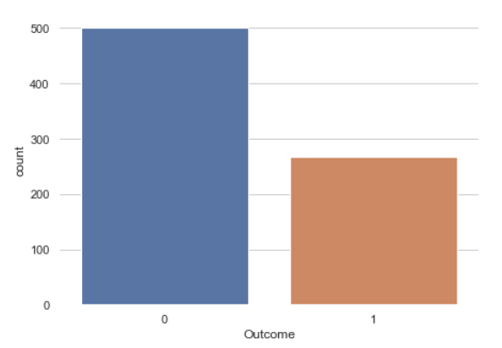
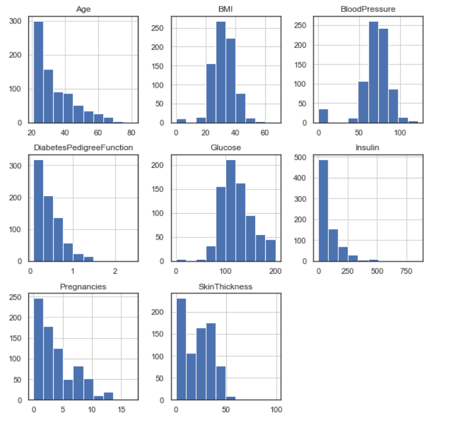
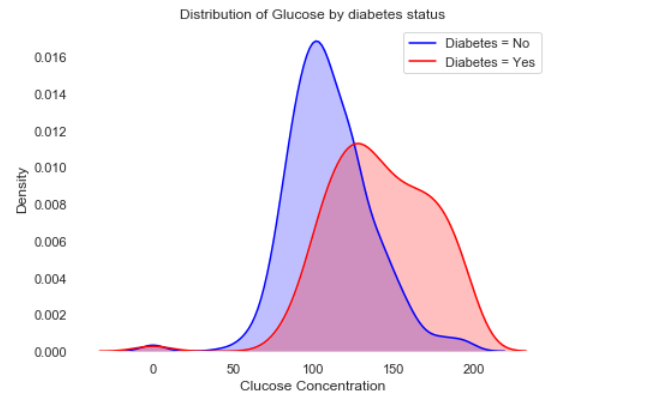
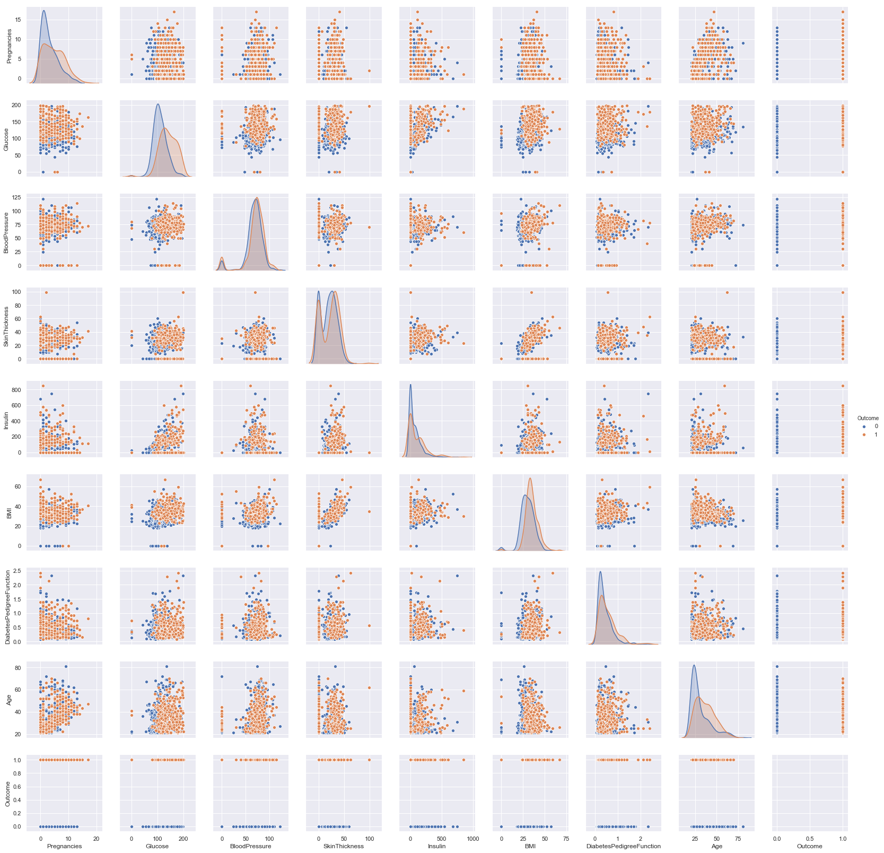
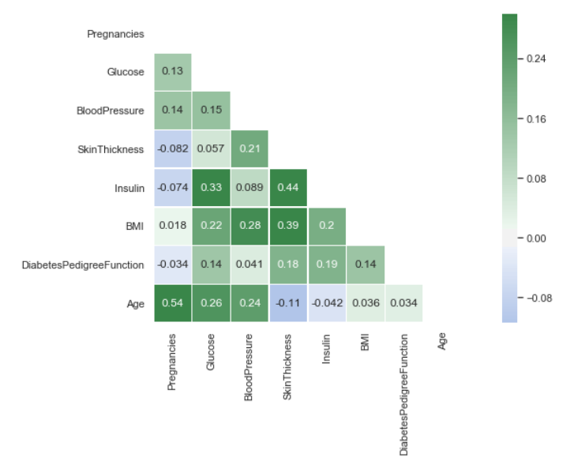
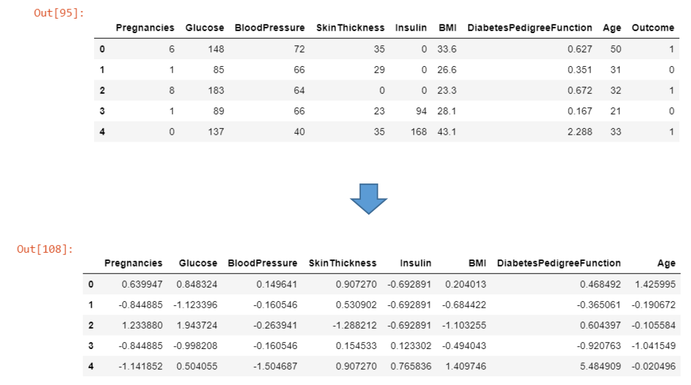
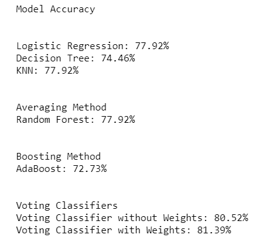

# Voting Classifier - Diabetes

## A. Goal
The main objective is to predict whether the people in the dataset has diabetes. Because in this example we focused on improving the accuracy of our prediction, we used an ensemble method – Voting Classifier – to combine the results of the base models. Two of the base models we have used are also ensemble models (Random Forest and Adaptive Boosting). We have used two versions of Voting Classifiers – with and without weights.

## B. Data Source
https://www.kaggle.com/uciml/pima-indians-diabetes-database

## C. Summary

_Exploratory Data Analysis_

Before performing EDA, we checked the dimension of the dataset and data types of the variables and examined the dataset for null values.

1. About one third of the people in the dataset has diabetes, and this split-up of the ‘Outcome’ will enable our models to predict more accurately for both the classes (1 and 0) – as compared with our earlier datasets in which one of the classes formed only about 10% of the entire data.

2. We plotted the distribution of the features that we will try to incorporate in our models.

3. We displayed one KDE plot to show the distribution of Glucose Concentration separately for people with and without Diabetes, and then we used Pair Plot to plot the distribution (for with and without diabetes) of other features as well. Pair Plots also show scatter plots of the variables.

4. Then we plotted a correlation matrix to show the correlation between different variables. This plot allows us to know which features have high correlation with others and thus to exclude the highly correlated ones from the model; however, none of the variables had a strong correlation with any of the others.

_Models and Performance_

1. To build our model, we made 30% of the dataset test data and the remainder training. Moreover, we also scaled the features using standardization because the features varied in magnitude and range. Scaling enabled us to have same magnitude levels for all the features.

2. Finally, we developed predict models using the following classifiers  
a. Logistic Regression  
b. Decision Tree  
c. KNN  
d. Random Forest  
e. Adaptive Boosting  

We have already used two ensemble methods - Random Forests (Averaging) and Adaptive Boosting (Boosting) – as our base models. To improve accuracy, we combined different classifiers using a Voting Classifier (with and without weights), which is also an ensemble method.

Following are the accuracies of the base models and the Voting Classifier.

- Accuracies of the base models:  
  *Logistic Regression*: 77.92%  
  *KNN*:77.92%  
  *Decision Tree*: 74.46%  
  *Random Forest*:77.92%  
  *AdaBoost*:72.73%  
  
- *Voting Classifier without weights* improved the accuracy to **80.52%**.
- *Voting Classifier with weights* slightly further improved the accuracy to **81.39%**.  
Following weights were given to the different base models. Heavier weights were assigned to the better performing models.  

| Model  | Weight |
| ------------- | ------------- |
| Logistic Regression  | 2  |
| Random Forest  | 2  |
| KNN  | 2  |
| Decision Tree  | 1  |
| Adaptive Boosting  | 1  |
